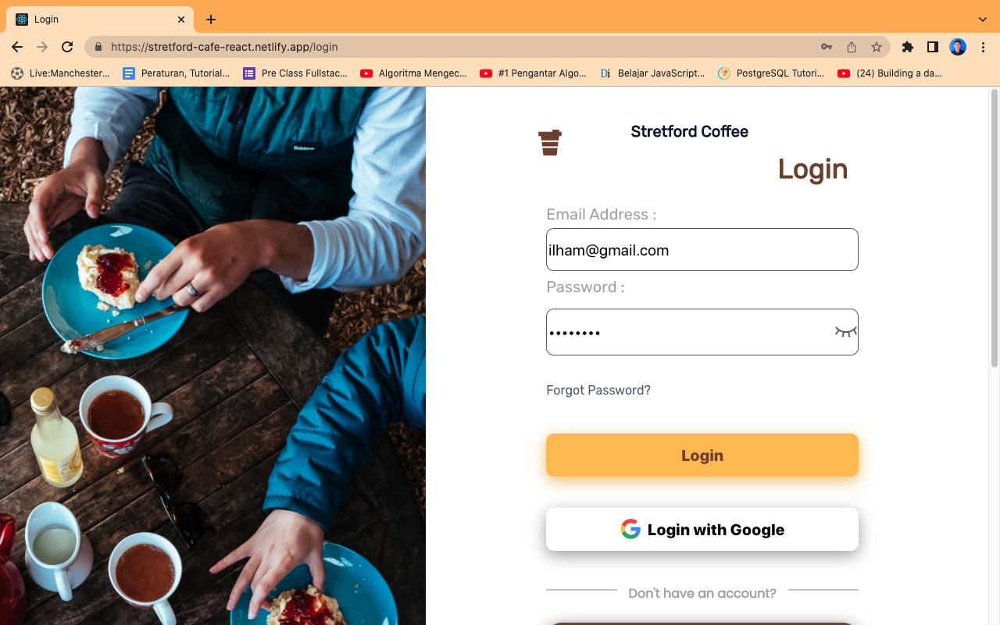
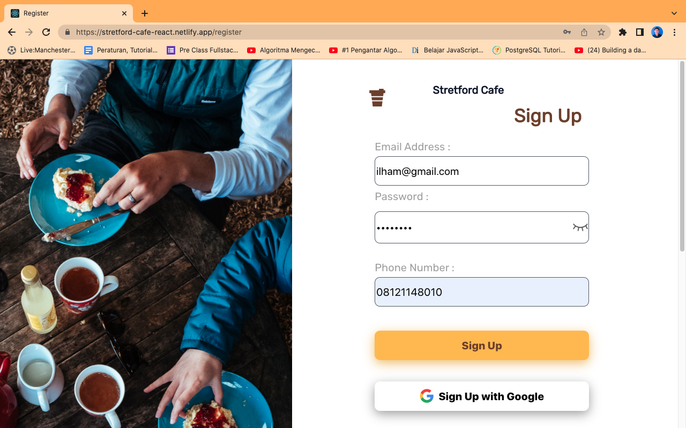
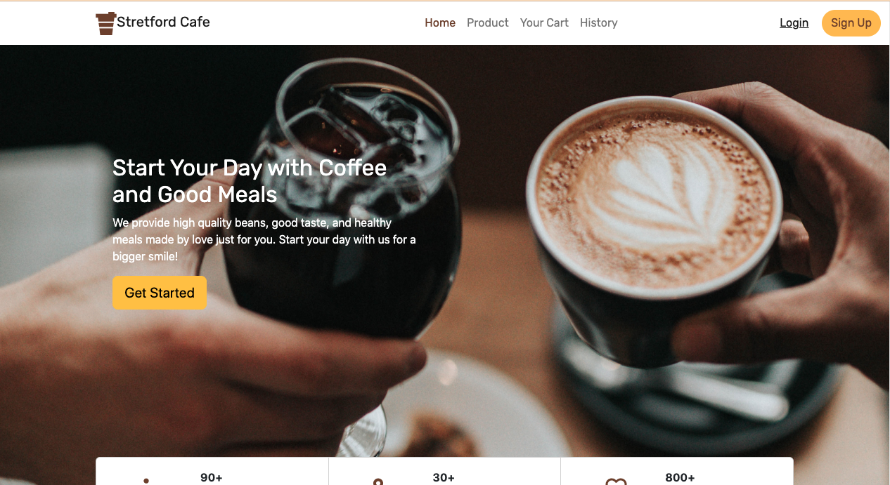
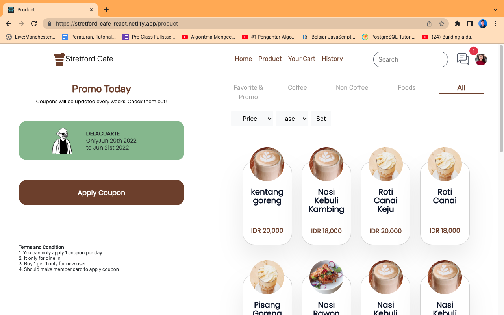
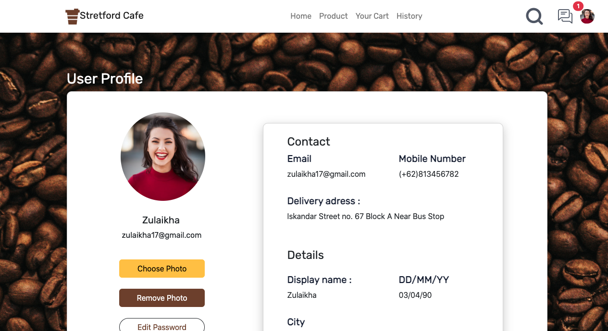

<h1 style="text-align:center">Stretford Cafe - Frontend</h1>

<div style="display:flex; justify-content:center">
    
</div>

## Built With

<!-- 
 -->

[](https://www.npmjs.com/package/react-router-dom)
[](https://www.npmjs.com/package/axios)
[](https://www.npmjs.com/package/chart.js)
[](https://www.npmjs.com/package/moment)
[](https://www.npmjs.com/package/redux)

## Features

### Users:

- Login
- Register
- Forgot Password
- Search product
- Product's detail
- Payment
- History
- Edit profile

### Admin:

- Add product
- Edit product
- Add promo
- Edit promo
- Dashboard Admin
## How to Run the Application

### 1. Clone this repository

Clone this repository by run the following code:

```
$ git clone https://github.com/IlhamNurrohman/stretford-cafe-client.git
```

### 2. Install dependency packages

Install dependency packages by run the following code inside project folder:

```
$ npm install
```

### 3. Configure .env file

Configure .env file by create file named .env inside project folder and add this line to the file:

```
REACT_APP_API_HOST = https://stretford-cafe.herokuapp.com
```

### 4. Run projects

Run this projects by run the following code:

```
$ npm start
```

It runs the app in the development mode.\
Open [http://localhost:3000](http://localhost:3000) to view it in your browser.

The page will reload when you make changes.\
You may also see any lint errors in the console.

## Preview

<div style="display:grid; grid-template-areas: 'a b'; row-gap:5px; align-items:left">





</div>

## Deployment

[Netlify deploy link](https://stretford-cafe-react.netlify.app)
## Related Projects

[Stretford Cafe Backend](https://github.com/IlhamNurrohman/Stretford-Cafe)
