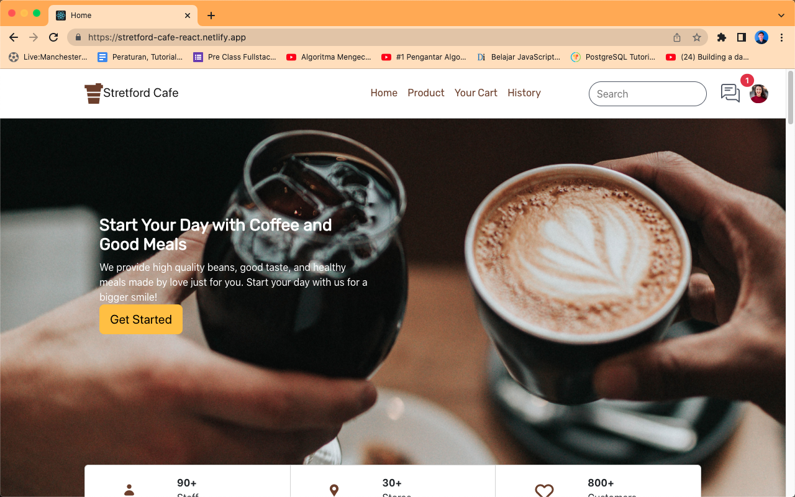
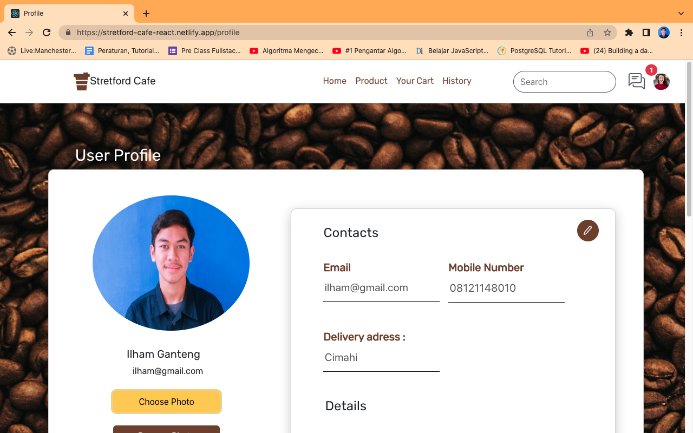

<h1 style="text-align:center">Stretford Cafe</h1>

<div style="display:flex; justify-content:center">
    
</div>

## Built With


## How To Install

1. Clone the repository
   ```
   $ git clone https://github.com/IlhamNurrohman/Stretford-cafe-client.git
   ```
2. Open VS Code or you can download and install it [here](https://code.visualstudio.com/)
3. To make it easier, you can install Live Server Extension for VS Code [here](https://marketplace.visualstudio.com/items?itemName=ritwickdey.LiveServer)
4. Right click _index.html_ then choose **Open With Live Server** menu

## Preview

<div style="display:grid; grid-template-areas: 'a b'; row-gap:5px; align-items:left">





</div>


## Backend

[link backend](https://github.com/IlhamNurrohman/Stretford-Cafe)
## Deploy

[link deploy](https://stretford-cafe-react.netlify.app/)